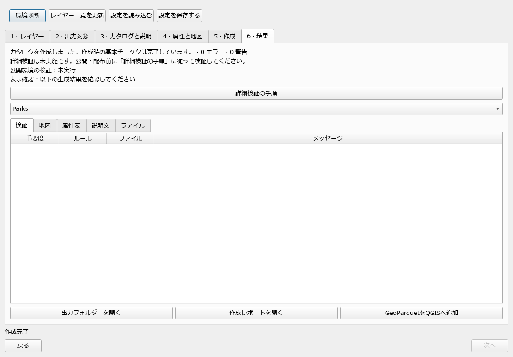

# Portolan Catalog Builder for QGIS

By **Kohei Hara** · [Source repository](https://github.com/hrko9gis/portolan-catalog-builder) ·
[Report an issue](https://github.com/hrko9gis/portolan-catalog-builder/issues)

Create a static Portolan catalog from layers already loaded in QGIS. The plugin exports analysis-ready GeoParquet, optional PMTiles with a MapLibre style, thumbnails, STAC metadata, README files and AI-agent guides. All end-user operations use the GUI.

The interface uses **English by default** and automatically uses **Japanese when QGIS uses Japanese**. Unavailable translations fall back to English. Documentation template language is a separate export setting.

**Version 0.2.0:** basic export checks run in QGIS; detailed Portolan and asset
validation is a separate user task. No native validator libraries are bundled or
downloaded. See [English validation guide](portolan_catalog_builder/help/validation-en.md)
and [Japanese validation guide](portolan_catalog_builder/help/validation-ja.md).
Official QGIS repository approval is pending.

[Japanese user guide](docs/user-guide-ja.md) · [Sample data](examples/README.md) ·
[Changelog](CHANGELOG.md) · [Build instructions](BUILDING.md) ·
[Contributing and bug reports](CONTRIBUTING.md)

## Install

The initial tested distribution targets **Windows x64, QGIS 3.44.13, Python 3.12, GDAL 3.13.2**. This is an experimental local-vector release. Other operating systems have not yet been tested. The QGIS environment must provide the GDAL Parquet driver and PyArrow; PMTiles needs its GDAL driver only when selected.

1. Download or locate `dist/portolan_catalog_builder-0.2.0.zip`.
2. In QGIS, open **Plugins → Manage and Install Plugins → Install from ZIP**.
3. Select the ZIP and install it. Enable **Portolan Catalog Builder**.
4. Open **Plugins → Portolan Catalog Builder → Create Portolan Catalog…**.
5. Use **Environment** to confirm GeoParquet, PyArrow, PMTiles (when requested) are available.

Catalog creation requires no command input, external validation runtime or online
service. Detailed validation is performed separately before publication, following
the included guide. The ZIP contains only plugin code, documentation and preview
web libraries, with no bundled native validator.

## Create a catalog

1. Load GeoJSON, GeoPackage or Shapefile layers in QGIS. Supported 2D memory layers also work.
2. Select layers. Assign unique collection IDs. **PMTiles is on by default**, but can be turned off for every layer or individually.
3. Choose all features, selected features, an intersecting map extent or a clipped extent. Capture the extent explicitly. Current edits, layer filters, joins and evaluated fields are included.
4. Enter the catalog title, description, producer, maintainer, contact and license. Supply a source URL when publishing another producer's data. Each collection needs a description.
5. For each collection, choose public fields and describe their meanings. Set a basic style if the QGIS renderer uses unsupported effects or labels. Optional collection overrides replace common catalog metadata.
6. Choose a **new** output folder and press **Build catalog**. Existing folders are never overwritten.
7. Review validation findings, GeoParquet attributes, documentation and thumbnails. **Open PMTiles map** opens the generated tiles and style in the default browser through a temporary loopback-only server. Keep the plugin window open while using it.

The result directory contains only the catalog and its registered assets. A sibling `.build-report` directory holds basic export checks, environment details and the explicit not-run status of detailed validation. The temporary `.portolan-build-*` directory is retained for diagnostics, including the snapshot; it can be removed after review when QGIS has released its files.

Save settings to a JSON file for reuse. A copy is also stored in the QGIS project when the project is saved. Use **Refresh layers** after adding input layers. When loading settings in another project, explicitly match missing source layers.

## What is checked

- Output IDs, metadata, field names, geometry types and CRS.
- Current layer edits captured before background conversion.
- GeoParquet row count and order-independent hashes of all public values and complete geometries, compared with the snapshot.
- Spatial ordering, bbox covering and statistics, with 100,000-row groups.
- Generated JSON and local file references. These basic checks do not establish full Portolan conformance.
- Detailed rashid validation is not run; follow the included guide in a separate environment.
- Optional PMTiles signature, reopening, style references, and an actual browser preview.

PMTiles omission may result in a recommendation warning. It does not prevent a GeoParquet-only catalog from being created. **Local validation does not verify hosting, CORS or HTTP range support at a future publication URL.**

## Current boundaries

- 2D point, line and polygon geometries, including multi-geometries. Mixed types, curves, Z/M and antimeridian-crossing datasets are rejected explicitly.
- Single-symbol, categorized and graduated styles use basic circles, lines and fills. Complex effects, labels, map-unit sizes and unsupported symbols need the explicit basic-style option.
- Tiling can simplify or omit features at dense zoom levels. GDAL warnings are recorded; PMTiles is for visualization, not precise measurement or complete feature counting.
- The current web preview uses the default browser rather than an embedded WebEngine.
- COG, uploads, existing-catalog merging, spatial partitioning and multilingual STAC trees belong to later releases.
- Dataset version history is not implemented. Rebuild into a new output folder.

See [the design](docs/qgis-portolan-plugin-design.md), [implementation and validation notes](docs/implementation-status.md), and [Japanese instructions](docs/user-guide-ja.md).

## Development

Use the QGIS Python launcher for tests, for example `python-qgis-ltr.bat scripts/run_tests.py` on Windows. These are developer commands only; the plugin never invokes Portolan or GDAL command-line tools.

- `scripts/run_tests.py`: unit and QGIS integration tests.
- `scripts/gui_smoke.py`: complete GUI-driven build through the event loop, with screenshot.
- `scripts/browser_smoke.py`: real PMTiles rendering using Playwright and installed Edge.
- `scripts/translations.py <lrelease>`: generate Qt TS/QM files from `i18n/ja.json`.
- `scripts/package.py`: package the plugin while excluding native validator dependencies.

See [BUILDING.md](BUILDING.md) for packaging without a validator. The historical
`requirements-runtime.lock` is retained only as a reference for external validation
testing; it is not a plugin runtime requirement. Do not install it into QGIS.

Plugin code is licensed under GPL-3.0-or-later. See [LICENSE](LICENSE) and
[third-party notices](THIRD_PARTY_NOTICES.md). Report reproducible issues through
[GitHub Issues](https://github.com/hrko9gis/portolan-catalog-builder/issues).
