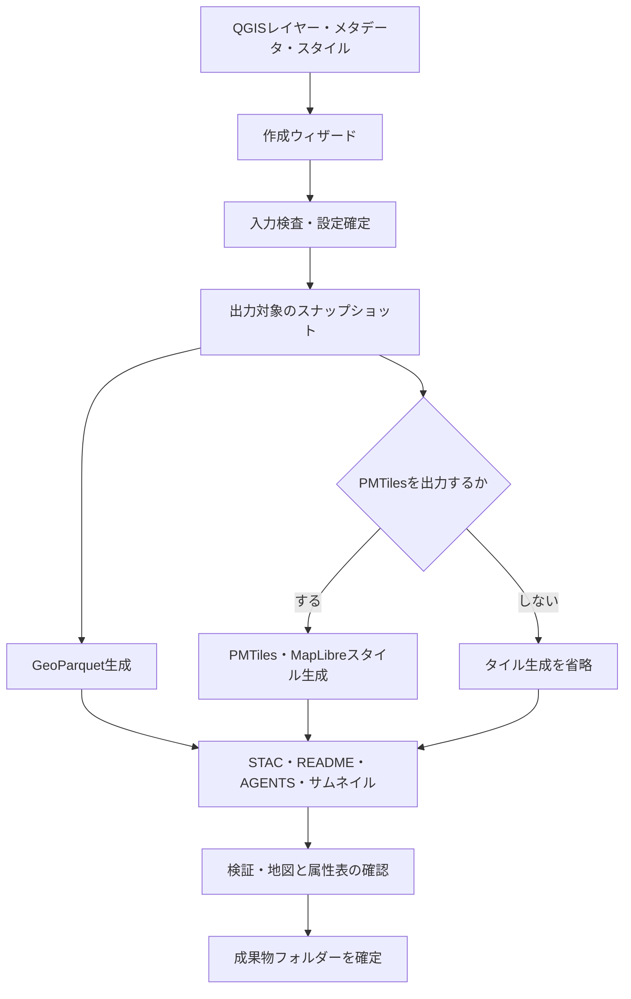
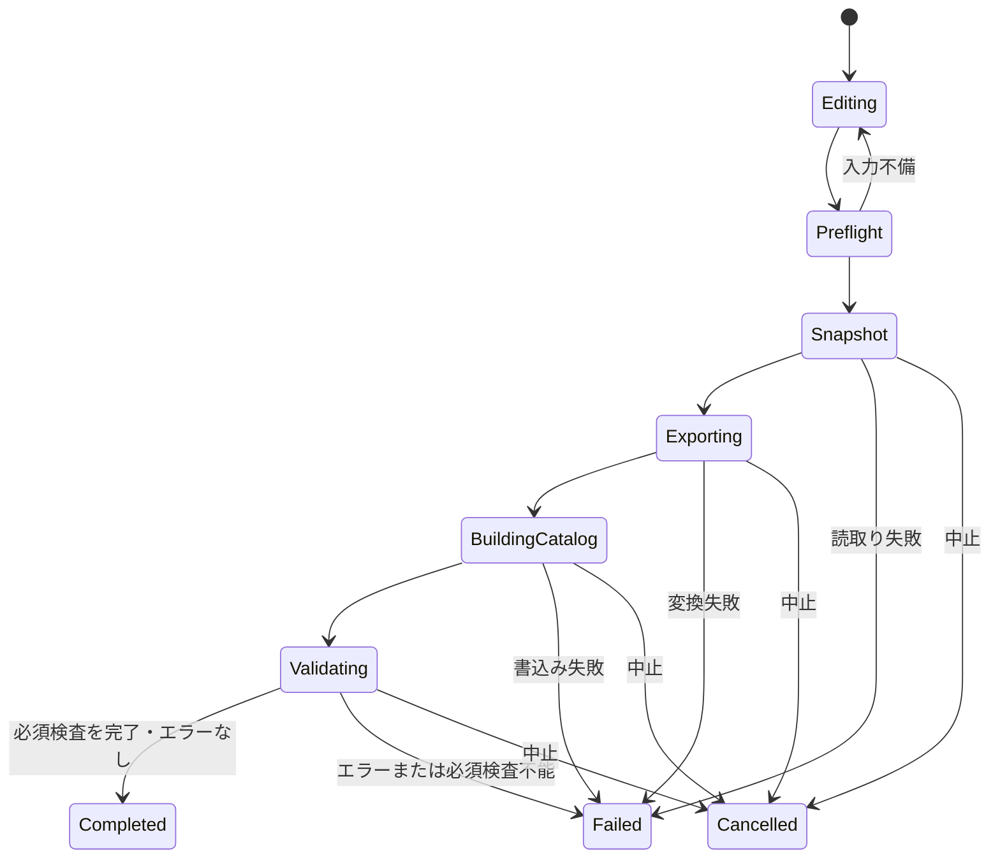

# Portolan Catalog Builder for QGIS 設計書

| 項目 | 内容 |
|---|---|
| 文書版 | 1.1 |
| 作成日 | 2026-09-16 |
| プラグイン名 | Portolan Catalog Builder（仮称） |
| プラグイン識別子 | `portolan_catalog_builder` |
| 文書の位置付け | 合意した機能に基づく基本設計・主要な詳細設計 |
| 実装状況 | 初期ベクタ版0.1.0を実装。対応環境・実装上の決定・確認済み範囲は[実装状況](implementation-status.md)を参照。本書の受入条件すべてを実行済みとするものではない |

## 1. 目的と設計方針

QGISに読み込んだGISレイヤーを選択し、GUI操作だけでPortolan向けのデータと地理空間情報カタログを作成する。利用者はコマンド入力、JSON・YAMLの手動編集、開発環境の準備を必要としない。

データ変換、説明情報の整備、地図表示の確認、検証を一連の画面操作として提供する。初期版はローカルフォルダーへの作成までを対象とし、ストレージへの公開は後続版で対応する。

本書では「必須」はプラグインの実装要件を表す。Portolanの規範要件そのものは、採用版の公式仕様・スキーマ・検証器を正とする。調査時点のmainブランチとリリース済み仕様は一致するとは限らないため、出荷時に採用する組み合わせを固定する。

### 1.1 合意済みの製品要件

| ID | 要件 |
|---|---|
| R01 | QGISのレイヤーを入力とし、GUIで作成を完結する |
| R02 | 複数レイヤーから1つのCatalogと複数Collectionを作成する |
| R03 | ベクタレイヤーのGeoParquetを必須出力とする |
| R04 | PMTilesは任意出力とし、初期状態はオン。一括設定とレイヤー別設定を提供する |
| R05 | PMTilesを出力する場合に対応するMapLibreスタイルを生成する |
| R06 | STACメタデータ、README.md、AGENTS.mdを生成する |
| R07 | 全地物・選択地物・地図表示範囲から出力対象を指定する |
| R08 | 出力属性と属性の説明をGUIで編集する |
| R09 | QGISの基本的なシンボル設定を表示用スタイルへ反映する |
| R10 | 生成物の検証、地図・属性表の確認を行える |
| R11 | 作成設定を保存し、同じ設定で再作成できる |
| R12 | 進捗表示、キャンセル、原因と修正先が分かるエラー表示を備える |
| R13 | 英語を標準表示とし、QGIS本体の表示言語が日本語の場合は日本語へ自動切替する。未対応言語では英語に戻す |

### 1.2 想定利用者

世界各国の自治体・研究機関・企業などでQGISを使い、GeoJSONやGeoPackage等を整備しているデータ提供者。STACやGeoParquetの詳細を知らなくても、データの説明と公開条件を入力できれば成果物を作成できることを目指す。

### 1.3 参考記事から取り入れる考え方

「PortolanでAI-Readyな地理空間情報カタログを作ってみた」の複数Collection作成、説明の整備、検証、地図・属性表確認という流れをGUIへ置き換える。特にAGENTS.mdには、ファイルの所在に加え、分析用データの選び方、座標系の注意、実際に確認した件数・集計例を含める。記事中のツールバージョンやコマンド構成は、そのままプラグインの依存条件とはしない。[参考記事](https://qiita.com/nokonoko_1203/items/614f699efd768cdaf3a6)

## 2. 対応範囲とリリース段階

| 機能 | 初期版 | 後続版 |
|---|---|---|
| ローカルベクタ入力 | GeoJSON、GeoPackage、Shapefile | 他のQGISベクタプロバイダーを追加 |
| 一時・メモリレイヤー | 点・線・面の基本型を対象に対応 | 複雑な型を拡張 |
| 複数レイヤー | 1レイヤー＝1Collection、平坦な配置 | グループからサブカタログを作成 |
| GeoParquet | 必須、1.1形式を採用予定 | 2.x、空間分割 |
| PMTiles | 任意、レイヤー単位 | 高度なズーム別表現 |
| スタイル | 単一・カテゴリ・段階分類 | ルール、ラベル、SVG等 |
| 文書・カタログ | 作成・設定保存・再生成 | 任意の既存カタログ取込み・編集 |
| 検証・プレビュー | ローカルのメタデータ・実体検証、地図・属性表 | 公開先の通信検証 |
| ラスタ | 対象外として理由を表示 | COG生成、複数シーン |
| リモート入力 | WFS、PostGIS等は初期版の保証対象外 | プロバイダーごとに追加検証 |
| 公開 | 作成したフォルダーを提供 | GUIでアップロード・差分更新 |
| 表示言語 | 英語を標準とし、QGISの日本語表示に追従 | 翻訳リソース追加による対応言語の拡張 |

WMS・XYZ背景地図・既存ベクタタイルを、解析用ベクタデータへ自動変換する機能は対象外とする。生成AIによる説明文補助、Registry登録、検索サーバーの構築も初期版には含めない。

### 2.1 対応環境の方針

- Windowsを最初の検証対象とする。macOS・Linuxは互換試験後に対応を宣言する。
- 開発開始時のQGIS LTRを第一候補とするが、正確なQGIS・Python・Qt・GDALの対応版は技術検証で確定する。
- QGISのバージョン番号だけで可否を判定せず、必要なドライバーと書込み能力を起動時に確認する。
- Unicodeのレイヤー名、属性値、ファイルパスを扱い、日本語と他の文字体系を検証対象に含める。
- QGIS同梱環境に対して利用者がpip等を実行する手順は要求しない。

## 3. 全体構成



処理は「GUI」「QGIS入力の読取り」「変換」「カタログ生成」「検証」「プレビュー」に分ける。Portolan CLIをラップする方式は採用せず、ライブラリAPIを使う。内部処理に独立プロセスが必要になった場合もGUIから管理し、端末や汎用CLIへの依存を追加しない。

## 4. 画面設計

### 4.1 起動と共通操作

QGISのプラグインメニューとツールバーに「Create Portolan Catalog…」（日本語：「Portolanカタログを作成…」）を追加する。レイヤーの右クリックメニューにも「Add to Portolan Export」（日本語：「Portolan出力に追加」）を設ける。

本書の日本語の画面名・メッセージ例は意味と日本語訳を示す。実装時の原文は英語とし、日本語文字列を標準表示として埋め込まない。製品名「Portolan Catalog Builder」は共通とする。

画面遷移は次の6段階とする。入力中は前後へ移動可能とし、作成開始後は設定を固定する。閉じる際は未保存の設定や実行中の処理を画面内で案内する。

| 画面ID | 名称 | 主な内容 |
|---|---|---|
| S01 | レイヤー選択 | レイヤー一覧、対象選択、形式対応状況 |
| S02 | 出力対象 | 地物の抽出方法、範囲、編集内容の扱い |
| S03 | カタログと説明 | 共通情報、Collection情報、文書補足 |
| S04 | 属性と地図表示 | 出力列、属性辞書、PMTiles、スタイル |
| S05 | 作成 | 保存先、事前検査、処理進捗、キャンセル |
| S06 | 結果 | 検証、地図、属性表、文書、成果物一覧 |

「環境診断」「設定を読み込む」「設定を保存する」は共通操作として提供する。

### 4.2 S01：レイヤー選択

| 列 | 挙動 |
|---|---|
| 出力する | 初回は表示中の対応レイヤーを選択。非表示レイヤーも手動選択可能 |
| レイヤー名 | QGISの表示名 |
| Collection ID | 自動候補を編集可能。重複はその場で表示 |
| データ種別 | 点・線・面など |
| 地物数 | 高速に取得できない場合は未計測と表示 |
| 座標系 | レイヤーCRS。未定義の場合は要修正 |
| PMTiles | レイヤー別のチェック。初期状態はオン |
| 状態 | 対応、要確認、対象外、および理由 |

表示状態はレイヤー選択の初期値にのみ使う。縮尺によって描画されない地物やシンボルルールで非表示の地物を、暗黙にデータから除外しない。

Collection IDは小文字英字で始まる英数字・ハイフン・アンダースコアに制限する。日本語名は表示タイトルに保持し、ID候補は`layer-01`等でもよい。確定後は表示名変更だけでIDを変えない。OS予約名、末尾の空白・ピリオド、パス区切りや親ディレクトリー参照を拒否する。

### 4.3 S02：出力対象

レイヤー単位で以下のいずれかを選択する。

| 方法 | 意味 |
|---|---|
| 全地物（既定） | QGISのプロバイダーフィルター適用後の全地物 |
| 選択地物 | 選択済み地物に限定。選択0件は入力エラー |
| 現在の地図表示範囲 | 確定した範囲と交差する地物に限定 |

地図表示範囲では「交差する地物をそのまま出力」を既定とし、「範囲の境界で切り抜く」を選択可能にする。範囲ポリゴンとそのCRSを設定として保存し、地図移動で勝手に変えず、「現在の範囲で更新」で取り直す。

QGISの未保存編集は「現在の編集内容を含む」を既定とし、含まれることを明示する。編集を含めない場合は利用者がQGIS側で保存・取消後に再読込みする。プラグインが元データへの保存や編集取消を代行しない。

結合属性と計算フィールドは、公開対象に選んだ列だけ現在の評価値として固定する。評価不能、曖昧な重複列名、未対応の値型は作成前に提示し、黙って欠落させない。

作成開始時に選択ID・フィルター・範囲・CRS・スタイル・属性定義を固定する。スナップショット取得中の対象レイヤー編集は防止または検出して中止する。固定完了後の編集は、その実行の成果物へ反映しない。

### 4.4 S03：カタログと説明

| 入力グループ | 項目 | 初期値・継承 |
|---|---|---|
| Catalog | ID、タイトル、説明、キーワード | プロジェクト情報を候補表示 |
| 提供者 | 作成者、加工者、管理・配信責任者、連絡先 | 共通値を各Collectionへ展開 |
| 利用条件 | ライセンス、利用条件URL | 未選択を既定。CC0等を勝手に選ばない |
| 出典 | 元データの説明ページ、取得時点、原典STACのURL | QGISメタデータから候補を取得 |
| Collection | ID、タイトル、説明、キーワード | レイヤーメタデータを候補表示 |
| 時間 | データの対象期間、基準日、不明の指定 | ファイル更新日を対象日時とみなさない |
| 文書補足 | 単位、品質、既知の制約、処理内容、利用例 | 利用者が追記 |

共通値を上書きしたCollectionは「個別設定」と表示する。継承は入力を便利にする仕組みであり、出力Collection JSONには必要な値を実体として書く。

時間範囲が不明の場合は、その事実を説明に残す。STAC上の表現は固定したプロファイルに従う。書出し日時で補完しない。出典のURLに認証情報を含めない。

### 4.5 S04：属性と地図表示

属性表は「公開」「元の列名」「出力列名」「型」「表示名」「説明」「単位」「欠損値の意味」「コード値の意味」を編集できる構成にする。QGISの別名・コメントを説明の候補に使う。出力列名変更時はスタイル参照も更新する。

簡易統計は件数・欠損数・数値の最小最大・必要な合計などを表示する。下見でサンプリングした値は「概算」と明示し、確認済みの集計結果として文書に転用しない。

PMTilesには一括の三状態チェック（すべてオン／すべてオフ／混在）と個別チェックを用意する。一括操作は対象レイヤーに適用され、適用後の状態を一覧で確認できる。

| 状態 | 画面・処理 |
|---|---|
| PMTilesオン | ズーム、簡略化、スタイル設定を有効化 |
| PMTilesオフ | 設定欄を無効化し、タイルと対応スタイルを生成しない |
| オフからオンへ戻す | 直前の設定を復元し、再検査 |
| 一部だけオン | 対象Collectionにだけタイルとスタイルを生成 |

ズーム設定は「推奨」と「手動」を提供する。推奨値は範囲・形状・密度から提案し、値そのものも表示する。全地物に最大ズーム14を固定適用しない。

### 4.6 S05・S06：作成と結果

保存先には新しい成果物フォルダー名を指定する。初期版は既存フォルダーへの直接上書きを禁止し、再作成時も新しい名前で生成する。

進捗は「読取り」「GeoParquet」「PMTiles」「説明とカタログ」「検証」の工程と現在のレイヤーを示す。PMTilesオフの工程は「対象外」と表示する。所要時間が未推定の処理に根拠のない残り時間を表示しない。

結果画面のタブは「検証結果」「地図」「属性表」「説明文」「ファイル」とする。検証結果のクリックで問題のレイヤーと設定欄へ移動できる。成功時は「出力フォルダーを開く」「GeoParquetをQGISへ追加」「設定を保存」を提供する。

### 4.7 国際化・表示言語

英語を原文・フォールバック言語とし、初期版に日本語翻訳を同梱する。通常はQGIS本体の表示言語へ自動追従し、プラグイン独自の言語選択は初期版では設けない。

| QGISの表示言語 | プラグインの表示 |
|---|---|
| 英語（en、en_US、en_GB等） | 英語 |
| 日本語（ja、ja_JP、ja-JP等） | 日本語 |
| 初期版で翻訳のない言語 | 英語 |
| 言語が取得できない、翻訳ファイルが欠落・読込み失敗 | 英語で起動し、診断ログに記録 |
| 日本語訳が未登録の文言 | その文言だけ英語にフォールバック |

言語判定ではQGISが実際に使用している翻訳言語を優先する。OSの地域設定や数値表示ロケールだけで判定しない。例えば日本語OSでもQGISが英語ならプラグインは英語にする。QgsApplicationの`translation()`を候補APIとし、採用QGIS版での動作を検証する。[QGIS翻訳言語API](https://api.qgis.org/api/classQgsApplication.html)

プラグイン起動時に言語を決定し、画面生成前に翻訳を読み込む。QGIS側で言語を変更した場合は、QGISを再起動して反映する方式を初期版の保証範囲とする。実行中の処理や入力内容を言語変更で作り直さない。

翻訳にはQt標準の仕組みを用い、英語の原文を`tr()`または`QCoreApplication.translate()`で扱う。日本語の翻訳元を`.ts`、配布用を`.qm`として`i18n/`に配置し、QTranslatorで読み込む。翻訳オブジェクトはプラグインの生存期間中保持し、無効化時に解除する。Qtは`qgis.PyQt`経由で使用する。[QGISプラグイン翻訳](https://docs.qgis.org/3.44/en/docs/pyqgis_developer_cookbook/plugins/plugins.html#translating-plugins)

翻訳対象はメニュー、ウィザード、ボタン、ツールチップ、進捗、検証の説明、エラー、プレビューの操作部とする。Webプレビューにも同じ言語を渡し、操作部の英語・日本語を一致させる。文の断片を連結せず、可変値はプレースホルダーで挿入し、複数形にも対応可能な構成にする。

外部ライブラリの診断原文は保持し、安定したルールIDに対応する利用者向け説明を翻訳する。未対応の診断は原文を表示する。ルールID、JSONキー、設定キー、ファイル名、Collection IDは翻訳しない。数字や日付の画面表示はロケールに対応させても、JSONの数値や機械可読日時は仕様の形式を維持する。

プラグイン管理画面向けの説明、配布ページ、基本利用手順は英語を標準とし、日本語版を補助として用意する。他言語追加は翻訳リソースの追加で対応できる構成にする。

### 4.8 表示言語と出力文書の区別

UIの言語変更によって、利用者が入力したタイトル・説明・属性名・値を自動翻訳しない。README・AGENTS.mdの定型文の言語はS03の「Document language／文書の言語」でEnglish（既定）または日本語を選択し、CatalogPlanへ保存する。既存設定を読み込んだ際も保存値を維持し、QGISの言語に連動して変えない。

初期版は1カタログにつき1種類の文書テンプレート言語とする。英語テンプレートを選んでも、日本語で入力した説明はそのまま保持する。複数言語のSTACツリーや文章の自動翻訳は初期版の対象外とする。

## 5. データ変換設計

### 5.1 入力とスナップショット

初期版は2次元のPoint、LineString、Polygonおよび対応するMulti型を保証対象とする。Z/M、曲線、GeometryCollection、混在形状は事前に検出し、初期版では変換を止めて理由を表示する。黙って2次元化したり線形化したりしない。

処理対象を一時GeoPackage等へ固定する。ただし中間形式による型変換が起きないことを確認し、元の属性スキーマと値の対応表を保持する。文字列・整数・実数・真偽・日付・日時の対応を試験し、配列・辞書等は初期版では公開列から外すか、利用者が明示した変換を必要とする。

プロバイダーを独立して安全に読める場合は独立した読取りハンドルを使う。QGISの編集バッファや式評価が必要な場合は、メインスレッドで小分けに取得してUIへ制御を戻しつつ保存する。全地物を一括でメモリに載せない。

### 5.2 座標系とジオメトリ

- GeoParquetはレイヤーのCRSを保持することを既定とし、必要なら出力CRSを選択する。
- 座標変換にはプロジェクトの変換コンテキストを使い、必要な変換グリッド不足を検出する。
- メタデータの空間範囲は出力対象から求める。範囲のCRSをファイルのCRSと混同しない。
- PMTiles用の変換はGeoParquetの座標を変更せず、独立した表示用処理として行う。
- Web Mercatorの表現可能範囲外を含む場合、初期版はPMTiles生成を止め、PMTilesをオフにできることを案内する。自動で地物を捨てない。
- 日付変更線を横断するデータは専用試験を必要とし、対応検証が済むまでは事前検査で対象外とする。
- 不正形状は位置と件数を提示し、既定では停止。修復を選択した場合は一時データだけに適用し、変更件数を記録する。
- 空・null形状は黙って除外しない。除外して続行する場合は明示的な設定と除外件数を残す。結果が0件となるCollectionは初期版では生成しない。

### 5.3 GeoParquet

初期版の出力プロファイル案はGeoParquet 1.1、WKB、ZSTDとする。空間順序はHilbertキーによる並べ替えを第一候補とし、行グループは既定100,000行、上限150,000行にする。bbox coveringと行グループの統計を生成し、生成後に実体を読み直して確認する。これは採用する変換プロファイルであり、GDALの既定値だけに任せない。[形式仕様](https://github.com/portolan-sdi/portolan-spec/blob/main/specs/portolan/formats.md)

空間ソートは大量データでもメモリ上限を設け、一時ディスクを使える実装にする。GDAL書込みAPIと、必要な空間ソート・統計処理を担当するライブラリは技術検証で組み合わせを確定する。ParquetドライバーはArrow依存のため、全QGIS配布環境で利用可能とは扱わない。[GDAL Parquet](https://gdal.org/en/stable/drivers/vector/parquet.html)

IDコードは文字列として先頭ゼロを保持する。nullと空文字、整数と実数、日時と文字列を区別する。日時のタイムゾーンが不明な場合は勝手にUTCと解釈しない。

### 5.4 PMTiles

GDALのPMTiles書込みAPIを第一候補とする。PMTilesはMVTを格納した表示用派生データとし、GeoParquetと同じスナップショットから作成する。GDALはPMTilesの読書きとズーム・簡略化設定を提供する。[GDAL PMTiles](https://gdal.org/en/stable/drivers/vector/pmtiles.html)

タイルに含める属性は公開を選択した列を基本とし、未対応型は事前に通知する。スタイル参照列を除外した場合は、列を復帰するかスタイルを変更するまで開始できない。

安定した一意キーがある場合はそれを使い、ない場合は出力用の一意キーを生成して両形式に保持する。MVT数値IDの制約で表現できないキーは文字列属性として保持する。自動キーは同一実行内の対応用であり、再作成をまたぐ不変性を保証しない。

タイル化は丸め・クリップ・簡略化を伴うため、GeoParquetとタイル全体の地物件数一致を合格条件にしない。タイル容量制限による地物の間引きも監視し、検出できた省略は報告する。検出能力と表示品質は技術検証の対象とし、タイル生成成功だけで品質確認を完了しない。

### 5.5 スタイルとサムネイル

| QGIS表現 | 初期版の変換 |
|---|---|
| 単一シンボル | 点の基本マーカー、線、塗りつぶし |
| カテゴリ分類 | 公開属性に基づく値別の描画 |
| 段階分類 | QGISで確定済みの区間境界と色を使用 |
| 透過率・線幅 | 対応可能な範囲で変換し、単位差をプレビュー |
| SVG・描画効果・複雑なルール・ラベル | 未対応内容を一覧表示し、基本スタイルへの変更を選択 |

MapLibreスタイルは生成したPMTiles内のレイヤー名を参照する。別名・分類値・境界値・nullの扱いを検査する。複雑な表現を基本スタイルに置き換えた場合は結果画面へ残す。

サムネイルはPMTiles設定とは独立し、初期状態をオンとする。対象スナップショットだけをQGISで描画し、背景地図を自動で焼き込まない。これはQGIS描画のプレビューであると区別し、PMTilesの見た目は別途実物で確認する。

## 6. カタログ・文書設計

### 6.1 出力構造

初期版はルートCatalogの直下にCollectionを配置する。例ではwestだけPMTilesを出力する。

```text
parks-catalog/
├── catalog.json
├── README.md
├── AGENTS.md
├── west/
│   ├── collection.json
│   ├── README.md
│   ├── AGENTS.md
│   ├── west.parquet
│   ├── west.pmtiles
│   ├── thumbnail.png
│   └── styles/
│       └── default.json
└── east/
    ├── collection.json
    ├── README.md
    ├── AGENTS.md
    ├── east.parquet
    └── thumbnail.png
```

プラグインの設定、実行ログ、検証レポート、一時ファイルはカタログの外に置く。例えば成果物と同じ親フォルダーの`parks-catalog.build-report/`に実行報告を保存する。ソースGISファイルを成果物へ無条件にコピーしない。

### 6.2 STAC生成

STAC 1.1.0を基礎とし、1つの解析用ファイルはCollectionのassetとして登録する。親子・ルート・文書・データへの参照を生成し、内部参照は移動可能な相対パスを基本とする。PMTilesオンの場合だけ所定のPMTilesリンクとstyle assetを追加する。[Portolan Core](https://github.com/portolan-sdi/portolan-spec/blob/main/specs/portolan/core.md)、[形式仕様](https://github.com/portolan-sdi/portolan-spec/blob/main/specs/portolan/formats.md)

出力の責務は次のとおりとする。細部のフィールド位置・拡張URIは採用版のスキーマで決定する。

| 情報 | 生成方針 |
|---|---|
| ID・タイトル・説明 | GUIで確定した値 |
| 空間範囲 | 出力データから計算し、参照する仕様の座標表現へ変換 |
| 時間範囲 | 利用者が確定した対象時期 |
| providers・license・出典 | 共通設定と個別設定を解決した値 |
| 属性辞書 | 出力列の名前・型・説明 |
| ファイル情報 | 最終バイト列からサイズとチェックサムを計算 |
| 仕様バージョン | 対応プロファイルの版を宣言 |
| データバージョン | 仕様版とは別に扱い、初期版では任意 |

JSON内の情報と実体の不一致を避けるため、最終ファイルを閉じてからサイズ・チェックサム・範囲を確定する。チェックサム表現も採用する拡張仕様に合わせる。公開URLが未定のローカル作成時に、架空の公開URLや公開済みのselfリンクを生成しない。

### 6.3 README・AGENTS.md

生成元はGUIで保存する構造化メタデータと文書補足とする。再生成で手入力を失わないよう、利用者の追記欄を設定側に保存する。成果物のMarkdownを直接編集した内容の逆取込みは初期版の対象外であり、画面上で案内する。

| 文書 | 主な内容 |
|---|---|
| ルートREADME | カタログ概要、Collection一覧、出典、利用条件、作成方法 |
| Collection README | データ説明、属性辞書、期間、座標系、加工内容、注意事項 |
| ルートAGENTS | Collectionへの案内、横断利用時の注意、対象範囲 |
| Collection AGENTS | 分析用ファイル、表示用ファイルの有無、属性の意味、確認済みの件数・集計例 |

集計例は公開列と実際の出力対象に対して計算する。例えば西2件・東1件の場合、Collectionの件数とカタログ全体の3件を明確に区別する。利用者入力の説明と自動計測値を区別し、未実行のSQLを「確認済み」と記載しない。

PMTilesオフの場合、文書に存在しないタイルやスタイルの利用手順を出力しない。生成AIの契約・APIキー・外部送信は不要とする。

## 7. 設定・内部データモデル

### 7.1 永続化

QGISプロジェクトのプラグイン用カスタム設定領域にJSONで保存する。プロジェクトが未保存の場合も、GUIから単独の設定ファイルへ保存できるようにする。

設定には`settings_schema_version`を持たせる。プラグイン版、Portolan仕様版、データ版を混同しない。古い設定は変換前に退避し、未対応の新しい設定版を黙って読まない。

レイヤーの紐付けはQGISレイヤーIDを基本とする。単独設定を別プロジェクトへ読み込んだ場合は、名前・プロバイダー情報等から候補を示し、利用者が対応先を選ぶ。名称一致だけで自動確定しない。保存する接続情報から資格情報を除去する。

### 7.2 主な内部モデル

| モデル | 主な内容 |
|---|---|
| CatalogPlan | Catalog情報、保存先、採用プロファイル、文書言語、Collection一覧 |
| CollectionPlan | レイヤー参照、ID、抽出方法、属性、メタデータ、出力設定 |
| FieldDefinition | 元の名前、出力名、型、説明、単位、コード値 |
| ExportOptions | 出力CRS、修復方針、GeoParquet設定、PMTiles設定、サムネイル |
| SnapshotManifest | 実行ID、確定範囲、件数、属性スキーマ、中間ファイル参照 |
| ArtifactManifest | 出力ファイル、用途、サイズ、チェックサム、参照関係 |
| ValidationFinding | 検証器、ルールID、重要度、対象パス、説明、修正画面 |
| BuildReport | 処理履歴、実行環境、採用版、検証段階の状態、警告 |

UIモデルは可変だが、実行用Planは確定後に変更不可とする。生成物の登録はArtifactManifestを唯一の入力とし、存在しない任意成果物へのリンクを作らない。

## 8. 処理・内部モジュール設計

### 8.1 モジュール分割案

```text
portolan_catalog_builder/
├── __init__.py                 # QGISエントリーポイント
├── metadata.txt               # プラグイン情報・対応QGIS版
├── plugin.py                  # メニュー・ライフサイクル
├── ui/                        # ウィザード、結果画面、環境診断
├── domain/                    # Plan、設定、実行状態
├── qgis_adapter/              # レイヤー読取り、スナップショット、描画
├── exporters/                 # GeoParquet、PMTiles、将来のCOG
├── styles/                    # QGISからMapLibreへの変換
├── catalog/                   # STAC組立て、リンク生成
├── documentation/             # 文書テンプレートと生成
├── validation/                # rashidアダプター、製品独自検査
├── preview/                   # 地図・属性表・ローカル配信
├── profiles/                  # 固定した仕様・拡張・検証器の組み合わせ
├── storage/                   # 設定保存、一時領域、成果物確定
├── i18n/                      # 英語原文に対応する翻訳（ja.ts、ja.qm等）
└── resources/                 # アイコン・同梱リソース
```

### 8.2 ライブラリの方針

| 用途 | 方針 |
|---|---|
| GUI・レイヤー操作 | QGIS提供のPyQGISとQtバインディング |
| GIS書込み・座標変換 | QGIS同梱GDAL/OGRを優先 |
| 空間ソート・Parquet補助 | 外部ソートと型保持を満たす方式を技術検証で選定 |
| STAC組立て | PySTACを候補とし、プロファイル固有部分は専用アダプター |
| 公式検証 | rashidの公開Python API |
| Web表示 | MapLibre GL JSとPMTilesライブラリの固定版 |
| 属性表 | 出力GeoParquetからページ単位に読み出すモデル |

rashidには`validate()`などのPython APIが公開されている。アダプターで版差を吸収し、内部の非公開関数には依存しない。独自検査で代替した結果を公式検証合格と表示しない。[rashid API](https://github.com/portolan-sdi/rashid#use-rashid-from-python)

### 8.3 バックグラウンド処理

QgsTaskで変換・計算・検証を実行する。メインスレッドに属するQgsVectorLayerやGUIをワーカーから直接操作せず、独立して読み出せる固定データを渡す。進捗と結果はシグナル経由で戻す。[QGIS Task設計](https://docs.qgis.org/3.44/en/docs/pyqgis_developer_cookbook/tasks.html)

初期版は同時に1件のカタログ作成を実行する。各ライブラリの内部スレッド数を制限可能にし、地図操作を著しく阻害しない。処理中にプロジェクトを閉じたりプラグインを無効化したりする場合は、停止処理が完了するまで資源を保持する。

### 8.4 実行状態と失敗時の動作



PMTilesオンでタイル作成に失敗した場合は成功扱いにしない。利用者が設定をオフに変更して再実行する。必須検査が完了し警告だけ残る場合は「作成完了・警告あり」とする。

カタログ全体を一時領域で生成し、成功後に成果物フォルダーへ確定する。1レイヤーが失敗しても、欠けたカタログを成功として確定しない。失敗時はレポートと診断用一時成果物を保持できるが、「公開用完成品」と区別する。

一時領域と成果物は可能なら同じボリュームに置き、確定時の移動を単純化する。移動失敗や容量不足でも既存成果物を変更しない。キャンセルは協調停止とし、即時停止できないライブラリ処理には「停止待ち」を表示する。

## 9. 検証設計

### 9.1 検証の段階

| 段階 | 内容 | 初期版 |
|---|---|---|
| V01 入力 | 対応型、CRS、名前、属性、範囲、必須説明、ドライバー、保存先 | 必須 |
| V02 変換 | 件数、属性型・値、範囲、形状処理の差分 | 必須 |
| V03 構造・メタデータ | STAC、採用プロファイル、リンク、文書、任意成果物との整合 | 必須 |
| V04 データ実体 | GeoParquetの形式・空間順序・統計、PMTiles等の参照実体 | 必須 |
| V05 表示 | PMTiles＋スタイルの実表示、属性表の読込み | 対象に応じて必須 |
| V06 公開環境 | Range Request、CORS、公開URL・ファイル情報 | 後続版 |

検証器から返る「検査不能」「スキップ」を合格として扱わない。公式検証の警告と製品独自の改善提案は別の種別で保存する。ルールを黙って無効化したり重要度を下げたりしない。[rashid検証とレポート](https://github.com/portolan-sdi/rashid#read-the-report)

PMTilesを省略した場合、公式検証器が推奨項目の警告を出せばそのまま提示し、「利用者が出力しない設定を選択」と補足する。非出力を製品上の必須エラーにはしない。存在しないPMTiles・スタイルへの参照が残る場合は別の整合性エラーとして扱う。

結果には「ローカル検証」「表示確認」「公開環境検証」の状態を個別表示する。初期版で公開環境が未検査であることを明記し、ネットワーク配信まで検証済みという表示をしない。

### 9.2 代表的なエラー表示

| 事象 | 表示と復帰先 |
|---|---|
| CRS未定義 | 「レイヤーの座標系を指定してください」→対象レイヤー |
| Collection ID重複 | 「IDが重複しています」→S01の対象セル |
| Parquetドライバー不足 | 「この環境ではGeoParquetを書き出せません」→環境診断 |
| PMTilesドライバー不足 | 「PMTilesをオフにするか対応環境を設定してください」→S04 |
| スタイル参照列の除外 | 「色分けに使う列が出力対象にありません」→属性設定 |
| 不正形状・変換失敗 | 件数、代表的な地物ID、原因→S02またはQGIS |
| 容量不足 | 処理場所と必要量の目安→保存先設定 |
| 検証器実行不能 | 「検証未完了」と原因。適合表示を出さない |

## 10. プレビュー設計

PMTilesオンのCollectionは、生成したPMTilesとMapLibreスタイルを読み、地図を表示する。PMTilesオフの場合は出力GeoParquetをQGISのプレビューキャンバスで表示し、「GeoParquetプレビュー」と明示する。オフ時にPMTilesドライバーやWeb表示エンジンを必須にしない。

Web表示はQt WebEngineによる埋込みを第一候補とする。配布上利用できない環境では、同じローカルプレビューをGUIのボタンから既定ブラウザーで開く。どちらも利用者によるサーバー起動やコマンド入力を必要としない。埋込み対応の可否は対応環境表で明示する。

プレビュー用HTTP配信は必要時だけループバックアドレスと空きポートで起動する。Range対応を備え、現在の成果物だけを公開する。パストラバーサルを拒否し、終了時に停止する。JavaScript等は固定版を同梱し、基本プレビューに外部CDNや背景地図を必須にしない。

属性表はGeoParquet実体をページ読込みし、列名・型・表示件数を示す。初期版の検索・並べ替えは取得済みページ内か全体かを明示する。巨大ファイルを表の表示のために全件ロードしない。

Portolan Browserでの互換性は受入試験で確認する。Browser本体を初期版プラグインに組み込むことは必須としない。

## 11. 配布・性能・運用

### 11.1 依存関係と環境診断

プラグインZIPとQGISプラグイン管理画面からの導入を基本とする。純Python依存はライセンス条件を確認して固定版を同梱する方針とし、GDALやQtの別コピーを無条件にQGISへ読み込ませない。

バイナリ依存はOS・Python ABI・QGIS配布版ごとに動作検証する。不足機能の解決方式は「対応QGIS配布版を指定」または「隔離した変換ランタイムをGUIで導入」から技術検証で決定する。追加ランタイムを採用する場合は配布元・版・整合性を検証し、QGIS既存環境を変更しない。未検証の配布方法を対応済みとしない。

診断画面はQGIS・Python・Qt・GDAL・rashidの版、GeoParquet/PMTiles書込み可否、Web表示可否、採用プロファイルを表示する。依存不足をデータ処理開始後に初めて発見しない。

### 11.2 性能と一時領域

- 10,000件、100,000件、1,000,000件の点・線・面で処理時間、ピークメモリ、一時ディスク量を計測する。
- 目標はバッチ処理と外部ソートによるメモリ上限管理とする。具体的な時間保証は検証機の結果から定める。
- 重い事前集計は遅延実行し、レイヤーを選択しただけで全件走査を開始しない。
- 読込み不能やディスク不足を記録し、失敗地点と実行IDを結果画面から確認できるようにする。
- 初期版の再試行は新規実行とする。途中成果物の再利用・工程単位の再開は後続版とする。

### 11.3 情報とファイルの扱い

公開しない属性は、GeoParquet・PMTiles・属性辞書・統計・文書のすべてから除く。ログに資格情報や属性値の全件を記録しない。Webプレビューで説明や属性値を表示する際はエスケープする。

設定ファイル・出力・一時領域のパスは正規化して管理する。清掃処理は当該実行が作成した一時領域だけを対象とし、元データや他の実行の成果物を削除しない。

## 12. 受入条件と試験計画

| ID | 対応要件 | 条件と期待結果 |
|---|---|---|
| A01 | R01–R03 | QGISに読んだ2つのGeoJSONから、GUIだけで2CollectionとGeoParquetを生成 |
| A02 | R04–R05 | 全レイヤーPMTilesオンで、タイル・スタイル・参照が揃い実表示できる |
| A03 | R04–R05 | 全レイヤーPMTilesオフで、タイル・対応スタイル・それらへの参照が存在しない |
| A04 | R04 | オンとオフの混在で、指定Collectionだけにタイルを出力 |
| A05 | R04・R11 | オンからオフへ再作成しても、旧タイルを引き継がず、旧成果物は変更されない |
| A06 | R07 | 全件・選択・範囲交差・切抜きで期待した地物と形状になる |
| A07 | R07–R08 | フィルター、未保存編集、結合、計算値が確定した設定どおりに反映される |
| A08 | R08 | 非公開列がデータ・タイル・説明・統計に混入しない |
| A09 | R08 | 日本語、先頭ゼロ、64bit整数、null、日付・日時を意図した型と値で保持 |
| A10 | R09 | 単一・カテゴリ・段階分類の主要な色・境界値が実タイルに反映される |
| A11 | R06・R11 | 文書補足と属性説明が設定保存・再読込み・再生成後も保持される |
| A12 | R10 | メタデータだけでなくGeoParquetの空間順序・統計を検査し、不備を検出 |
| A13 | R10 | 壊れたリンク・サイズ・チェックサム・スタイル参照を検出 |
| A14 | R04・R10 | PMTiles未出力に伴う推奨警告を必須エラーにせず、警告自体は保持 |
| A15 | R10 | 必須検査の実行不能を「検証済み」と表示しない |
| A16 | R12 | キャンセル・容量不足・変換失敗で元データと既存成果物が変わらない |
| A17 | R01・R12 | 対応環境で導入から出力確認まで端末・CLI操作が不要 |
| A18 | R03・R04 | PMTiles環境が不足していても、オフならGeoParquet作成を実行できる |
| A19 | R10 | Portolan Browserの固定した試験版で一覧・属性表・オン対象の地図を確認 |
| A20 | R06・R10 | 公園サンプルで西2件・東1件・全体3件・樹木合計60を実データから確認 |
| A21 | R13 | QGISが英語の場合、OSが日本語でも画面・メニュー・プレビュー操作部は英語 |
| A22 | R13 | QGISが日本語の場合、jaおよび地域付き表記で日本語訳が読み込まれる |
| A23 | R13 | 未対応言語・翻訳読込み失敗・未翻訳文言で英語にフォールバックし、操作できる |
| A24 | R13 | QGISの言語変更後の再起動で表示が切り替わり、プラグイン無効化時に翻訳を解除 |
| A25 | R06・R11・R13 | UI言語を切り替えても入力内容・ID・機械可読値・保存済み文書言語は変わらない |
| A26 | R13 | 英語・日本語で可変値・複数形・文字幅・数値入力を確認し、翻訳ファイルが配布物に含まれる |

試験はドメイン処理の単体試験、QGISを含む統合試験、GUI操作による受入試験に分ける。大規模データは性能試験、ネットワーク配信は後続版の公開試験として管理する。試験用データは権利関係が明確な合成データを基本とする。

## 13. 実装前の技術検証と開発順序

### 13.1 技術検証の完了条件

| 項目 | 確認内容 | 決定すること |
|---|---|---|
| 環境 | 対象Windows/QGISでドライバー・型保持・依存導入を確認 | 対応版と配布方式 |
| GeoParquet | 空間順序、統計、型保持、外部ソート | 変換エンジンと設定 |
| PMTiles | GDAL生成、間引きの把握、スタイル参照、実表示 | 生成設定と品質報告 |
| rashid | 公開API、オフライン検証、採用仕様との一致 | 固定する仕様・検証器版 |
| プレビュー | 埋込み・ブラウザー代替・Range読込み | OS別表示方式 |
| QGIS読取り | 未保存編集、結合、計算列、大量データの固定 | スナップショット方式 |
| 国際化 | 実際の表示言語取得、日本語翻訳、英語フォールバック、Web操作部の追従 | 言語判定アダプターと翻訳の配布工程 |

上記が未確認の段階では「どのQGISでも導入可能」「公式仕様に適合済み」とは宣言しない。CLIを使う実装への変更が必要になった場合も、本書のGUI・API方式を無断で置き換えず設計差分として扱う。

### 13.2 開発順序

1. 対応環境と変換・検証APIの技術検証。
2. レイヤー選択・設定モデル・スナップショット実装。
3. GeoParquet・STAC・文書生成とPMTilesオフ経路の完成。
4. 任意PMTiles・基本スタイル・地図プレビュー追加。
5. 検証結果UI、設定再利用、キャンセル、失敗時保護。
6. 英語原文・日本語翻訳の確認、受入試験、性能測定、配布パッケージと利用手順の作成。

### 13.3 後続版の設計方向

- COG：ラスタの内部タイル、概要画像、統計を生成し、単一画像と複数シーンを区別する。
- サブカタログ：QGISのグループをCatalogに対応させる。
- 既存カタログ更新：IDと利用者説明を保持し、変更内容を確認して反映する。
- 公開：S3互換等の保存先をGUIで設定し、データ転送後にメタデータを切り替え、公開URLを検証する。
- 大規模化：空間分割、処理再開、更新対象だけの再生成を追加する。
- 高度なスタイル：ラベル、外部リソース、複雑なルールに段階的に対応する。

## 14. 参照資料と版管理

以下は2026-09-16に参照した資料。mainブランチ等は可変のため、実装時には採用タグまたはコミット、スキーマURI、依存版、Browser試験版を`profiles/`のマニフェストとBuildReportへ記録する。

| 資料 | 用途 |
|---|---|
| [Portolan公式サイト](https://www.portolan-sdi.org/) | 目的とエコシステム |
| [Portolan Specification](https://github.com/portolan-sdi/portolan-spec) | 仕様全体・版管理 |
| [Core](https://github.com/portolan-sdi/portolan-spec/blob/main/specs/portolan/core.md) | カタログ・メタデータ・配信・文書 |
| [Formats](https://github.com/portolan-sdi/portolan-spec/blob/main/specs/portolan/formats.md) | 出力形式と実体検証 |
| [rashid](https://github.com/portolan-sdi/rashid) | 公式検証とPython API |
| [GDAL Parquet](https://gdal.org/en/stable/drivers/vector/parquet.html) | GeoParquet書込みと依存条件 |
| [GDAL PMTiles](https://gdal.org/en/stable/drivers/vector/pmtiles.html) | PMTiles生成 |
| [QGIS Tasks](https://docs.qgis.org/3.44/en/docs/pyqgis_developer_cookbook/tasks.html) | バックグラウンド処理の制約 |
| [QGISプラグイン翻訳](https://docs.qgis.org/3.44/en/docs/pyqgis_developer_cookbook/plugins/plugins.html#translating-plugins) | Qt翻訳リソースの作成と配布 |
| [QgsApplication API](https://api.qgis.org/api/classQgsApplication.html) | 実際の翻訳言語とロケールの区別 |
| [Portolanとは何か](https://qiita.com/rino_yume/items/9b0ff6dfa6d7ad5f3f83) | 背景と利用イメージ |
| [PortolanでAI-Readyな地理空間情報カタログを作ってみた](https://qiita.com/nokonoko_1203/items/614f699efd768cdaf3a6) | 複数Collection・文書・検証・閲覧の実例 |
